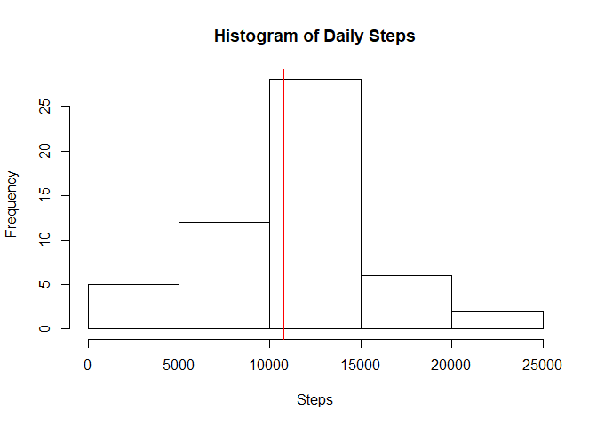
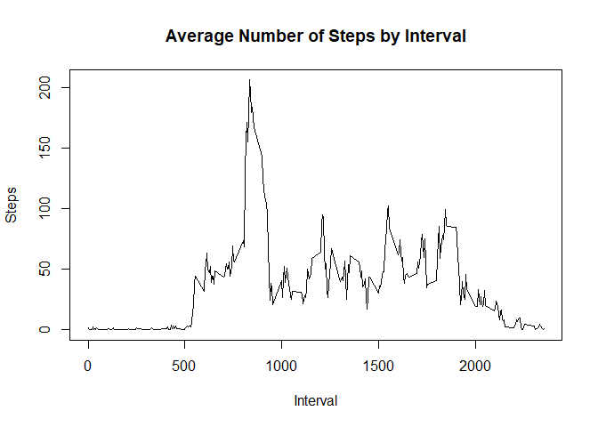
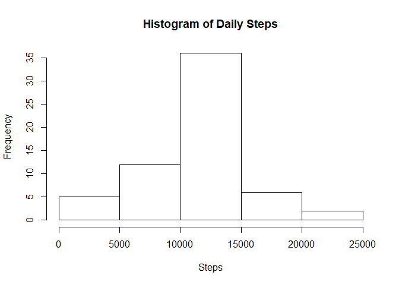
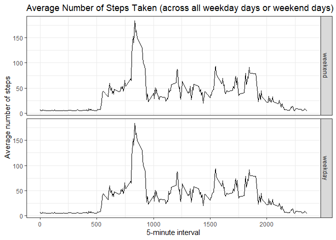

## Loading and preprocessing the data

```r
unzip("activity.zip", files = "activity.csv")
data <- read.csv("activity.csv")
str(data)
```

```
## 'data.frame':	17568 obs. of  3 variables:
##  $ steps   : int  NA NA NA NA NA NA NA NA NA NA ...
##  $ date    : Factor w/ 61 levels "2012-10-01","2012-10-02",..: 1 1 1 1 1 1 1 1 1 1 ...
##  $ interval: int  0 5 10 15 20 25 30 35 40 45 ...
```

```r
data$date <- as.Date(data$date)
```


## What is mean total number of steps taken per day?
1. Calculate the total number of steps taken per day

```r
step_by_day <- aggregate(steps ~ date, data, sum)
head(step_by_day)
```

```
##         date steps
## 1 2012-10-02   126
## 2 2012-10-03 11352
## 3 2012-10-04 12116
## 4 2012-10-05 13294
## 5 2012-10-06 15420
## 6 2012-10-07 11015
```

2. If you do not understand the difference between a histogram and a barplot, research the difference between them. Make a histogram of the total number of steps taken each day

```r
hist(step_by_day$steps, main = "Histogram of Daily Steps",
     xlab = "Steps")
abline(v=mean(step_by_day$steps,na.rm = T),col="red")
```

<!-- -->

3. Calculate and report the mean and median of the total number of steps taken per day

```r
mean_steps <- mean(step_by_day$steps, na.rm = T)
median_steps <- median(step_by_day$steps, na.rm = T)
median_steps
```

```
## [1] 10765
```

```r
mean_steps
```

```
## [1] 10766.19
```
- Median: 10765
- Mean: 1.0766189\times 10^{4}

## What is the average daily activity pattern?
1. Make a time series plot (i.e. \color{red}{\verb|type = "l"|}type="l") of the 5-minute interval (x-axis) and the average number of steps taken, averaged across all days (y-axis)

```r
steps_by_interval <- aggregate(steps ~ interval, data, mean)
plot(steps_by_interval$interval,steps_by_interval$steps,type = "l",
     main = "Average Number of Steps by Interval", xlab = "Interval", ylab = "Steps")
```

<!-- -->

2. Which 5-minute interval, on average across all the days in the dataset, contains the maximum number of steps?

```r
max_steps_by_interval <- steps_by_interval[which.max(steps_by_interval$steps),1]
max_steps_by_interval        
```

```
## [1] 835
```

## Imputing missing values
Note that there are a number of days/intervals where there are missing values (coded as \color{red}{\verb|NA|}NA). The presence of missing days may introduce bias into some calculations or summaries of the data.

1. Calculate and report the total number of missing values in the dataset (i.e. the total number of rows with \color{red}{\verb|NA|}NAs)

```r
na_sum <- table(is.na(data))   
```
Number of missing values: 2304

2. Devise a strategy for filling in all of the missing values in the dataset. The strategy does not need to be sophisticated. For example, you could use the mean/median for that day, or the mean for that 5-minute interval, etc.

```r
data1 <- data
for(i in 1:ncol(data1)){
  data1[is.na(data1[,i]), i] <- mean(data1[,i], na.rm = TRUE)
}
```

3. Create a new dataset that is equal to the original dataset but with the missing data filled in.

```r
data1 <- data
for(i in 1:ncol(data1)){
  data1[is.na(data1[,i]), i] <- mean(data1[,i], na.rm = TRUE)
}
```

4. Make a histogram of the total number of steps taken each day and Calculate and report the mean and median total number of steps taken per day. Do these values differ from the estimates from the first part of the assignment? What is the impact of imputing missing data on the estimates of the total daily number of steps?

```r
step_by_day1 <- aggregate(steps ~ date, data1, sum)
hist(step_by_day1$steps, main = "Histogram of Daily Steps",
     xlab = "Steps")
```

<!-- -->

```r
mean_steps1 <- mean(step_by_day1$steps, na.rm = T)
median_steps1 <- median(step_by_day1$steps, na.rm = T)
median_steps1
```

```
## [1] 10766.19
```

```r
mean_steps1
```

```
## [1] 10766.19
```
- Median: 1.0766189\times 10^{4}
- Mean: 1.0766189\times 10^{4}
- Median Diff: -1.1886792
- Mean Diff: 0

The impact of imputing missing data is neglegible on the mean daily steps, but it does reduce the median daily steps.


## Are there differences in activity patterns between weekdays and weekends?
For this part the \color{red}{\verb|weekdays()|}weekdays() function may be of some help here. Use the dataset with the filled-in missing values for this part.

1. Create a new factor variable in the dataset with two levels – “weekday” and “weekend” indicating whether a given date is a weekday or weekend day.

```r
data1$Weekday <- 1
data1$Weekday <- ifelse(weekdays(data1$date)=="Saturday"|weekdays(data1$date)=="Sunday","weekend","weekday")
data1$Weekday <- factor(data1$Weekday,levels = c("weekend","weekday"))
```

2. Make a panel plot containing a time series plot (i.e. \color{red}{\verb|type = "l"|}type="l") of the 5-minute interval (x-axis) and the average number of steps taken, averaged across all weekday days or weekend days (y-axis). See the README file in the GitHub repository to see an example of what this plot should look like using simulated data.

```r
library(ggplot2)
```

```
## Warning: package 'ggplot2' was built under R version 3.5.3
```

```r
steps_by_interval1 <- aggregate(steps ~ interval, data1, mean)
names(steps_by_interval1)[2] <- "steps_by_interval"
data1 <- merge(data1,steps_by_interval1,by="interval")
p1 <- ggplot(data1,aes(interval,steps_by_interval))
p1 + geom_line() + facet_grid(Weekday~.) + theme_bw() + 
        labs(x = "5-minute interval", y = "Average number of steps",
             title = "Average Number of Steps Taken (across all weekday days or weekend days)")
```

<!-- -->
